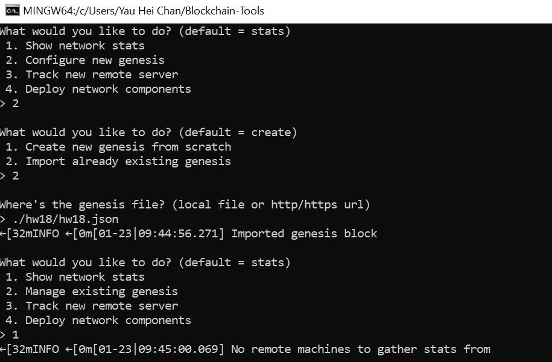
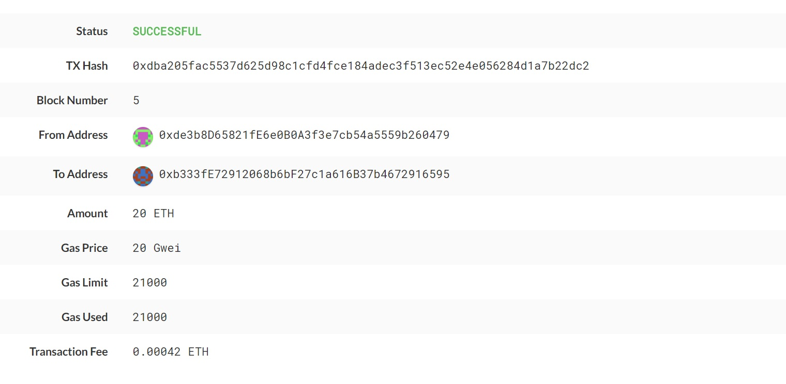

# The HW18 Network

## Documentation that explains how to start the network that is actually requested by the homework instructions

* First download the hw18.json file from the repository.

* Next we create the genesis block by running puppeth and import the hw18.json

Run 
```
./puppeth 
```

* Named the network hw18, and select the option to configure a new genesis block.

* Choose "import already exist genesis" and provide the path to the downloaded json file in step 1.



* Next we initialize the nodes with hw18 network settings. To initialize first node and second node, run following command respectively: 

```
./geth init hw18.json --datadir node1
./geth init hw18.json --datadir node2
```

* Then we create two nodes' data directory using the geth command and a couple of command line flags by running the following line in your terminal window (Git Bash in Windows):

```
./geth account new --datadir node1
./geth account new --datadir node2
````

* Launch the first node into mining mode with the following command:

```
./geth --datadir node1 --mine --minerthreads 1
```

* The --mine flag tells the node to mine new blocks.

* The --minerthreads flag tells geth how many CPU threads, or "workers" to use during mining. Since our difficulty is low, we can set it to 1.

* We then open another terminal window and navigate to the same directory as before. We launch the second node and configure it to let us talk to the chain via RPC.

```
./geth --datadir node2 --port 30304 --rpc --bootnodes "enode://<replace with node1 enode address>" --ipcdisable
```

* Open MyCrypto GUI wallet to connect to the node with the exposed RPC port.

* Click on the change network. Then select a custom network, put both network name and node name to "hw18" and include the chain ID 333, and use ETH as the currency. Enter http://127.0.0.1:8545 as the URL. Click Save & use Customer Node.

* After connecting to the custom network in MyCrypto, it can be tested by sending money between accounts.

* Select the View & Send option from the left menu pane, then click Keystore file.

* On the next screen, click Select Wallet File, then navigate to the keystore directory inside your Node1 directory, select the file located there, provide your password when prompted and then click Unlock.

* In the To Address box, type the account address from Node2, then fill in an arbitrary amount of ETH:

* Confirm the transaction by clicking "Send Transaction", and the "Send" button in the pop-up window.

* Click the Check TX Status when the green message pops up, confirm the logout:

* You should see the transaction go from Pending to Successful in around the same blocktime you set in the genesis.



* Finally, You can click the Check TX Status button to update the status.